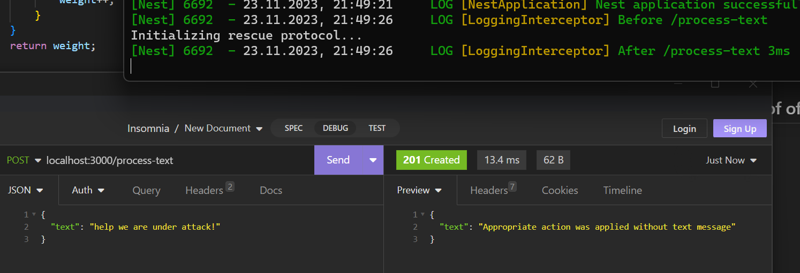
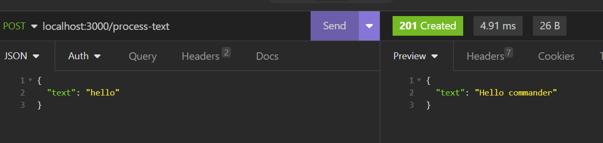
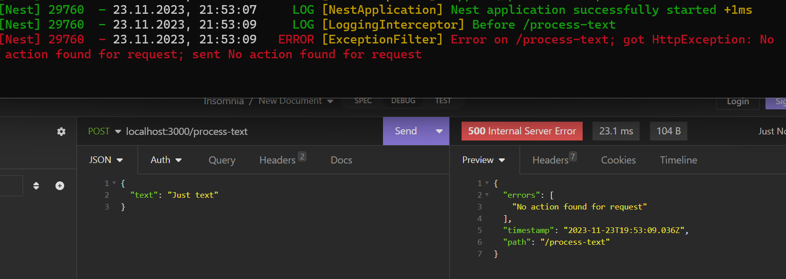
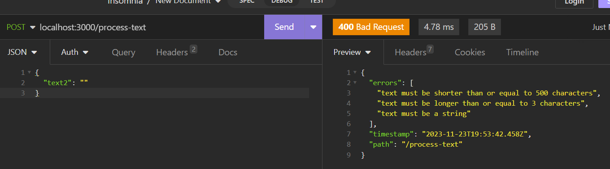

# About project
Project made as first step of interview. Idea of project is to create API for handling text messages from "Space Station Starship" simulating usage of LangChain.

# Documentation
## Modules
### TextProcessing
Module is responsible for handling http requests for text-processing. It's using LangChain module to receive LLM response and handle it either by invoking action or responding with message directly.
### LangChain
Module is responsible for all LangChain communication using local storage for all commands.
## Interceptors
### Logging
All http requests are logged via LoggingInterceptor.
### Error
All errors are handled in ExceptionFilter to respond with common interface.
### Validation
All endpoints using ValidationPipe to handle validation of dto's.
## Proof of work

